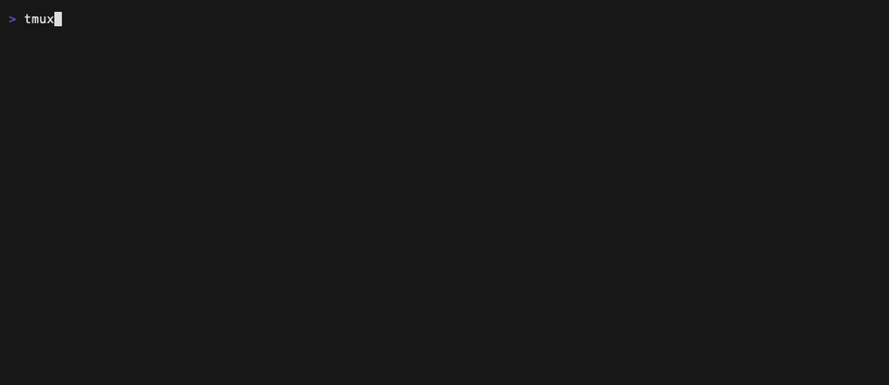

# ticker-watch

`ticker-watch` is a small read-only terminal quote monitor backed only by Yahoo Finance through `yfinance`.

It supports a Rich live table for active viewing and a compact cache-backed status line for tmux.



## Install

```bash
pip install -e ".[dev]"
```

## Quick Start

```bash
ticker-watch init
ticker-watch list
ticker-watch once
ticker-watch daemon start
ticker-watch status
```

Default symbols are `SOXL`, `SNDK`, `BTC-USD`, and `0700.HK`.

## Commands

```bash
ticker-watch init
ticker-watch once
ticker-watch watch
ticker-watch status
ticker-watch add SYMBOL
ticker-watch remove SYMBOL
ticker-watch list
ticker-watch daemon start
ticker-watch daemon stop
ticker-watch daemon status
```

## tmux

Add this to `~/.tmux.conf`:

```bash
set -g status-right "#(ticker-watch status --compact --marquee --marquee-width 90)"
set -g status-right-length 200
set -g status-interval 1
```

The status command reads `~/.cache/ticker-watch/latest.json`; it does not fetch from Yahoo directly.

If tmux does not show prices, use the absolute path because the tmux server may not share your shell PATH:

```bash
set -g status-right "#(/opt/homebrew/bin/ticker-watch status --compact --marquee --marquee-width 90)"
set -g status-right-length 200
```

## Config

`ticker-watch init` creates:

```yaml
refresh_seconds: 60
provider: yahoo
watchlist:
  - symbol: SOXL
    type: us
    name: SOXL
  - symbol: SNDK
    type: us
    name: SanDisk
  - symbol: BTC-USD
    type: crypto
    name: Bitcoin
  - symbol: 0700.HK
    type: hk
    name: Tencent
```

Add and remove symbols with:

```bash
ticker-watch add AAPL --type us --name Apple
ticker-watch add BTC-USD
ticker-watch add 0700.HK
ticker-watch remove AAPL
```

When `--type` is omitted, `*-USD` is treated as crypto, `*.HK` as Hong Kong, and everything else as US.

## Cache And Status

`ticker-watch once` fetches quotes, writes the cache, and prints a Rich table. `ticker-watch daemon start` starts a background process that refreshes the same cache every `refresh_seconds`.

`ticker-watch status` prints one compact line:

```text
SOXL 71.20 ▲2.1% | BTC 108,240 ▼0.4% | SNDK 68.55 ▲0.6%
```

If the cache is missing, it prints a short message telling you to run `ticker-watch daemon start` or `ticker-watch once`. If the cache is stale, the line starts with `STALE`.

## Daemon

The MVP daemon uses a PID file:

```bash
ticker-watch daemon start
ticker-watch daemon status
ticker-watch daemon stop
```

The foreground loop is also available:

```bash
ticker-watch daemon run
```

Logs are written to `~/.cache/ticker-watch/ticker-watch.log`.

## Watch Mode

```bash
ticker-watch watch
```

This runs a Rich live table and refreshes using the configured interval.

## Files

- Config: `~/.config/ticker-watch/config.yaml`
- Cache: `~/.cache/ticker-watch/latest.json`
- Daemon log: `~/.cache/ticker-watch/ticker-watch.log`

## Safety

This MVP is read-only. It uses only `yfinance`, no account login, no keys, and no private market data.
